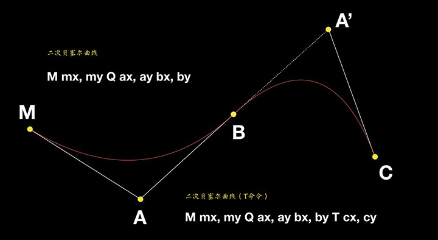

## 1. 贝塞尔曲线


* [youtube](https://www.youtube.com/watch?v=f_LJGK3ODws&feature=youtu.be)

## 2. 二次贝塞尔曲线

### 2.1 命令Q

| 命令           | 名称          | 参数   |
|:------------- |:-------------|:-----|
| Q             | quadratic Bezier curveto        | (x1,y1 x,y) |

### 2.2 表达式


### 2.3 切线表达式


### 2.4 示例
<SVG-s04-01/>

### 2.5 源码

```html
<svg xmlns="http://www.w3.org/2000/svg" width="740" height="300">
    <path d="M10 10 Q350,480 700,10" stroke="red" fill="transparent"/>
</svg>
```

## 3. 二次贝塞尔曲线T命令

### 3.1 命令T

| 命令           | 名称          | 参数   |
|:------------- |:-------------|:-----|
| T             | smooth quadratic Bezier curveto  |(x,y)|

"**快捷命令T会通过前一个控制点，推断出一个新的控制点。这意味着，在你的第一个控制点后面，可以只定义终点**"，图示解释：T命令会以B为对称点，得出A点的镜像A'，我们只需要确定终点C，即可得到由B、A'、C作为控制点的二次贝塞尔曲线；我们可以继续添加T命令，绘制出更多的二次贝塞尔曲线，这些曲线首尾光滑连接。**T命令前面必须是一个Q命令，或者是另一个T命令**，如下图所示：



### 3.2 示例
<SVG-s04-03/>

### 3.3 源码

```html
<svg xmlns="http://www.w3.org/2000/svg" width="720" height="300">
    <path d="M18 160 Q230,330 450,150 T754,366" stroke="red" fill="transparent"/>
</svg>
```

## 4. 三次贝塞尔曲线

### 4.1 命令C

| 命令           | 名称          | 参数   |
|:------------- |:-------------|:-----|
| C             | curveto       |(x1,y1 x2,y2 x,y)|

### 4.2 表达式


### 4.3 示例

<SVG-s04-02/>

### 4.4 源码

```html
<svg xmlns="http://www.w3.org/2000/svg" width="720" height="300">
    <path d="M10 10 C250,480 400,-100 700,90" stroke="red" fill="transparent"/>
</svg>
```

## 5. 三次贝塞尔曲线S命令

### 5.1 命令S

| 命令           | 名称          | 参数   |
|:------------- |:-------------|:-----|
| S             | smooth curve       |(x2,y2 x,y)|


### 5.2 示例

S命令要分两种情况：
* **情况一：S命令跟在一个C命令或者另一个S命令的后面**: 此种情况的S命令同T命令原理相同，它的前两个控制点不需要提供(由对称镜像所得)，只需要提供后面两个控制点坐标即可

<SVG-s04-04/>

* 源码
```html
<svg xmlns="http://www.w3.org/2000/svg" width="720" height="300">
    <path d="M30,208 C65,47 154,47 194,103 S320,395 506,57" stroke="red" fill="transparent"/>
</svg>
```

* **情况二：S命令单独使用**: "前面没有C命令或者另一个S命令，那么它的两个控制点就会被假设为同一个点" —— 这句话摘自[MDN](https://developer.mozilla.org/zh-CN/docs/Web/SVG/Tutorial/Paths)，“**两个控制点假设为同一个点**”实在不理解，实验发现，此时S命令与Q命令达到效果一致，均为二次贝塞尔曲线。下面示例与[示例2.4](#_2-4-示例)效果一致。

<SVG-s04-05/>

* 源码
```html
<svg xmlns="http://www.w3.org/2000/svg" width="720" height="300">
    <path d="M10 10 S350,480 700,10" stroke="red" fill="transparent"/>
</svg>
```

## 6 命令汇总

| 命令           | 名称          | 参数   |
|:------------- |:-------------|:-----|
| Q             | quadratic Bezier curveto        | (x1,y1 x,y) |
| T             | smooth quadratic Bezier curveto  |(x,y)|
| C             | curveto       |(x1,y1 x2,y2 x,y)|
| S             | smooth curve       |(x2,y2 x,y)|


## 参考

* [Bézier curve](https://en.wikipedia.org/wiki/B%C3%A9zier_curve)
* [MDN](https://developer.mozilla.org/zh-CN/docs/Web/SVG/Tutorial/Paths)
* [贝塞尔曲线](https://zh.wikipedia.org/wiki/%E8%B2%9D%E8%8C%B2%E6%9B%B2%E7%B7%9A)
* [贝塞尔曲线扫盲](http://www.html-js.com/article/1628)
* [在线绘制贝塞尔](http://myst729.github.io/bezier-curve/)